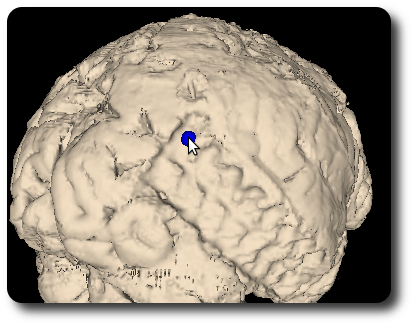
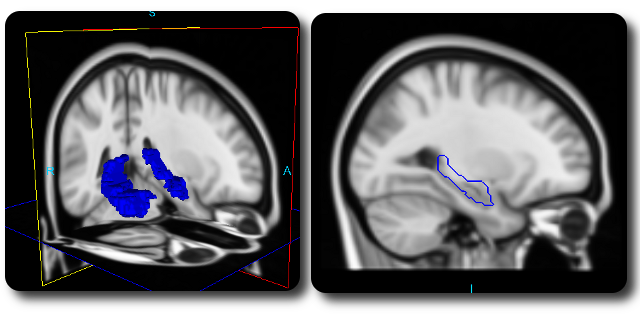

Frequently Asked Questions
=====================================================================

How can I insert markers for my MRI?
^^^^^^^^^^^^^^^^^^^^^^^^^^^^^^^^^^^^^^^^

In PyLocator, markers are used to tag locations in 3d space.  They are
visualized using spheres and circles. The main use case is the localisation
of EEG electrodes. These can be either surface electrodes or implanted
ones.

Basically, you have three options to insert a new marker.

In the slice widgets 
""""""""""""""""""""

Especially when you are marking locations *inside* the brain, you'll want
to use the slice widgets for marking. 

 * Move the slice to the desired position so you can see the point you want 
   to mark (target)
 * Simply hover the mouse cursor over the target
 * Hit the key *i* on the keyboard

Thats all. A blue circle will pop up, and in the 3d render windows above, a 
shpere will appear.

In the marker list
""""""""""""""""""

When you know the exact coordinates of your target you can insert a new marker
by entering these coordinates directly. Use the list of markers to do so

 * In the toolbar of the list of markers, hit the "Add" button
 * In the dialog, enter the coordinates
 * Press the "Ok"-button to confirm

Now the new marker will be inserted at the desired position.

On an iso-surface
"""""""""""""""""

In certain situations your target might be easier to identify on a 
reconstructed iso-surface (see below), e.g., surface electrodes from 
simultaneous EEG/fMRI-experiments or subdural electrodes in brain extracted 
MRI recordings from epilepsy-patients.

PyLocator lets you intuitively put marks on such surfaces:

 * Reconstruct an iso-surface (see below)
 * Find your target by navigating in the surface rendering window
 * Hover the mouse cursor over the target
 * Hit the key *i* on the keyboard

PyLocator tries to find the first point of the iso-surface that is below your 
mouse cursor and insert a marker here. If you have more than one is-surface 
rendered you must select on which surface you want to insert your marker in 
the settings of list of surfaces.

How can I reconstruct iso-surfaces?
^^^^^^^^^^^^^^^^^^^^^^^^^^^^^^^^^^^^^^^^
Looking at slices of tomgraphic scans is nice and helpful - slices is actually
what tomography is all about. But this isn't all one can do with such 
recordings, sometimes we just cannot grasp all the information contained.

Calculating and rendering iso-surfaces can sometimes help here. is-surfaces are
the 3d analogon of contour lines, connecting neighboring points of equal
intensity.

Rendering such surfaces with PyLocator is a one-click process: **Just click the 
"Add" button on the toolbar of the surfaces list**. PyLocator tries to estimate 
a good choice for a threshold of the surface, i.e., the value for which the 
iso surface is calculated.

If the result is not as you expected (which is not really unlikely...), you can
adjust the settings of the iso surface. Click on the list entry, and the 
options appear.

 * **Threshold**: Intensity value for which the iso surface is calculated. The 
   minimum of the slider is the minimal value of your image, maximum 
   accordingly
 * **Opacity**: Opacity is like "1-transparency". Reduce the opacity if you want
   to see other parts of the rendered scene that would otherwise be hidden, 
   e.g., other surfaces, markers, ROIs
 * **Color**: You can choose a color for the surface. We have some predefined 
   colors in a dropdown-list. If none of these fits your needs (or you just 
   want to be creative), choose "custom..." from the list, and you can choose 
   from the whole spectrum of RGB space

Below these, there is an initially closed section to control the VTK pipeline.
Here you can choose whether and how to use the **Connect Filter** and the 
**Decimate Filter**. Just play around a little bit to see how these settings 
influence the result.

The Decimate Filter is disabled as default, but it might be useful to reduce
the complexity of the surface in order to **increase the performance on older 
computers**.

.. note::
    If you wonder what the "Render" button is good for, you probably can forget
    it. In older versions, there used to be situations where changes in the 
    settings didn't directly get applied to the rendered scene. As of version 
    1.0 of PyLocator, these situations should no more exist, but if you think
    you have come in such a situation, you can force a redraw using the 
    "Render"-Button

.. index:: 
    pair: ROI; region-of-interest
    

How can I render regions-of-interest?
^^^^^^^^^^^^^^^^^^^^^^^^^^^^^^^^^^^^^^^^
Navigating through a brain can be really complex, and one might quickly loose 
orientation. In such situations, it can really be helpful to have some 
"landmarks". Here, regions-of-interest (ROIs) come into play.

ROIs can be loaded as additional, binary Nifti-files: they contain 1 for 
"inside the ROI" and 0 for "outside". An example for a ROI is available here:
`hippocampus.nii.gz <http://pylocator.thorstenkranz.de/download/hippocampus.nii.gz>`_
[#f1]_

To add a ROI to PyLocator, switch to the list of ROIs and click on the 
"Add"-Button. A file selection dialog lets you choose the Nifti file. After 
the dialog hase been closed, the ROI is rendered immediately

ROIs are shown in all visualization widgets: as iso surfaces in three 3d widgets
and as contour lines in the slice widgets.

.. [#f1] This file in compressed Nifti format only has approximately 10 kB, 
    compared to >6MB for the uncompressed file. For files containing only zeros
    and ones, the effect of GZip is really impressive
    
