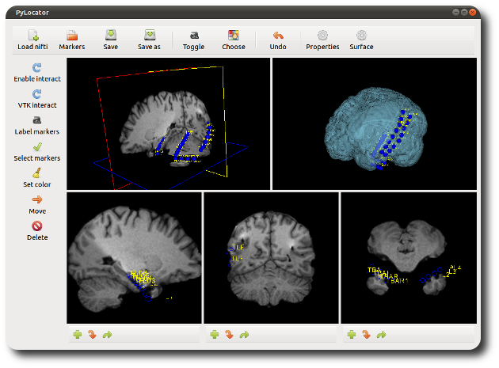
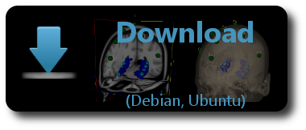

PyLocator
=====================================================================
Localization of EEG-electrodes from MRI-volumes
-----------------------------------------------

PyLocator is an application for localizing EEG electrodes from MR-images.
It uses VTK to show a neat GUI for marking electrode locations in 3d-space.

It is based on previous work by John D. Hunter and Michael Castell as
part of `pbrain <https://github.com/nipy/pbrain>`_, now maintained by Eli
Albert. PyLocator works as a stand-alone program without any dependencies
from pbrain.

Screenshot
----------

Contents
--------
.. toctree::
    :maxdepth: 2

    install
    tutorial
    faq

Information on how to obtain and configure PyLocator correctly can be obtained
in the :doc:`Installation </install>` section.

To get a feeling of what PyLocator can do and to get used to the controls, 
we recommend our little :doc:`Tutorial </tutorial>`. It provides an overview of the main features
of PyLocator and has severavl screenshots.

We also have a :doc:`Frequently Asked Questions </faq>` section. If your question is not answered here,
please write me an E-Mail to info@pylocator.thorstenkranz.de . I will try to reply as soon as possible. 

License 
-------- 
PyLocator is distributed under a BSD-style license, and
thus is free software (both in the sense of `free beer and free speech
<http://en.wikipedia.org/wiki/Gratis_versus_Libre>`_). Details can be found in the 
`LICENSE <https://github.com/thorstenkranz/PyLocator/blob/master/LICENSE>`_-file distributed with the source code.

Indices and tables
==================

* :ref:`genindex`
* :ref:`modindex`
* :ref:`search`

