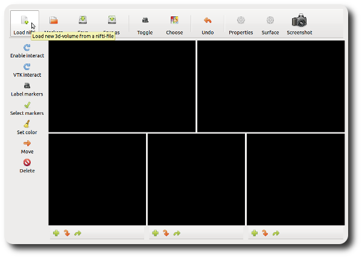
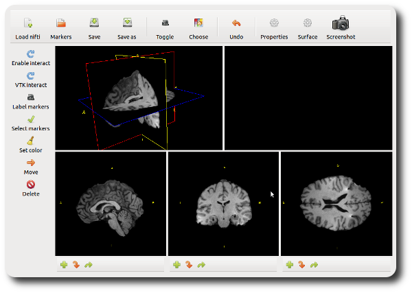
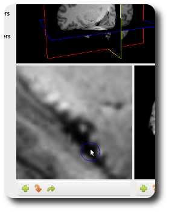
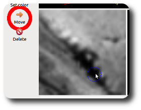
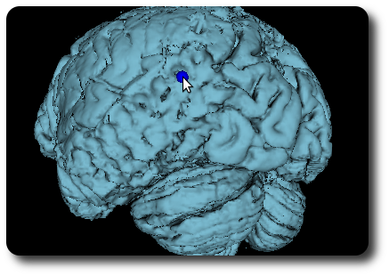

Tutorial
=====================================================================

This section shows a basic usage-example and thus introduces the main
concepts of Pylocator.  It is arranged as a step-by-step instruction and
uses a dataset which is available 
`here <http://pylocator.thorstenkranz.de/download/post2std_brain.nii.gz>`_.

Loading the MR image
-----------------------------------------------
After starting the program (refer to :doc:`Installation </install>` for
details) you'll see the main window of PyLocator. It consists of two toolbars
(a main toolbar at the top and a secondary at the left side) and 5 subwindows
that are all black for now.

First you'll have to load a Nifti file containing the MR recording. Pushing
the first button in the main toolbar brings up a little dialogue where you
can choose the "post2std_brain.nii.gz" file.

.. note::
  The MR image is a post-implantation image
  containing two temporal depth electrodes, temporo-lateral strip electrodes
  and temporo-basal electrodes on either side.
  
  It was preprocessed using FSL: 

  1. first, a pre-implantation image was brain-extracted and normalized to a MNI152_T1_1mm-template. The transformation matrix was saved.
  2. then the post-implantaion image was normalized to the pre-implantation image, also saving the matrix
  3. these two matrices where then concatenated; using this new matrix the post-implantation image was transformed to the MNI template.
  4. finally, the image was brain-extracted.

After closing the dialogue, the image is being loaded and the 5 subwindows come 
to live - or at least four of them.

The lower row shows three slice views of the MR volume (let's call them *slice 
widgets* from now on). Exactly the same cut planes are also visible in the upper-left 
subwindow (subsequently called *planes widget*), but arranged in a 3d setting.

Controlling the views
---------------------
Getting used to interacting with these widgets is maybe the hardest time
using PyLocator. It's typical VTK style: you'll need all three mouse buttons
and your keyboard, and their respective behaviour depends on where you use
them. But just go ahead and try, once you get a feeling, it works like a charm.

While you're in "Interact Mode" (button *Enable Interact* in the left toolbar,
default), the controls basically are:

Planes widget
  Left mouse button
    When clicked on one of the planes, the corresponding coordinates and intensity 
    are displayed. If you drag this button somewhere not on any plane, you can rotate 
    the virtual camera  around the planes object. If you additionally hold down the Ctrl-Key,
    the camera will roll around its viewing direction.
  Right mouse button
    When dragged on-plane, you can adjust the thresholds of the colormap for all planes.
    Drag left/right for adjusting the **level** (center of the colormap-range), drag 
    up/down to change the **window** (width of the colormap-range). To clarify this 
    concept, let's look at a little "diagram"::
      
                                 _______white___________
                                /
                               /
                              /
                             /
                            /
      _____black___________/
                           |  ^  |    Level
                           <----->    Window

                           
    When dragged off-plane, you can move your camera into / out of the scene.

  Middle mouse button
    When dragging on-plane you can move the planes. Dragging at the edges rotates the plane.
    Off-plane you can translate the focal point of the camera.

Slice widgets
  These slices are automatically synchronized to the cut planes in the planes widget.
  The right and middle mouse button behave mailny the same as *off-plane* in the plane 
  widget. Additionally, you can use the mouse wheel to slowly move the slices back and forth.

Marking electrodes
------------------
PyLocator uses Markers to help in the localization of electrodes. Every Marker is represented 
as a small sphere in 3d-space. In the plane widget you can see these spheres, while in the 
slice widgets they are visible as small circles (if the slice intersects the sphere).

Inserting markers
....................

First, move the cut planes so that you can see the electrode you want to mark. Use the 
controls as described above to zoom in. Move you mouse above the electrode location (in one of 
the slice widgets) and press the button **I** (as in *insert*) on your keyboard. A blue circle appears, 

Congratulations! You just inserted your first electrode marker.

If you aren't satisfied with it's location, use the "Move" tool to adjust it

You might have noticed that after inserting markers, also the fifth subwindow isn't empty anymore.
You can see the little spheres also there. Let's call it the **surface widget**. We will explain it
later.

Labeling the markers
....................
After having marked some electrodes, you can assign labels to the electrodes. Use the corresponding
tool from the toolbar, and the click on one of the spheres in the plane widget or one of the circles 
in the slice widgets.

A little dialogue will pop up, you can enter a label, hit O.k. Afterwards, the label shows up as
yellow text next to the marker.

You can reedit the labels anytime later using the same method.

Saving markers to file
......................
Finally, when you want to export the electrode locations, you can save them as a simple text file to 
disk. Use the **Save to**-button from the main toolbar. Choose a directory and filename and your done.

electrode_locations.txt::

  TBPR1,22.3044795975,-5.109097651,-37.8967504764,3.0,0.0,0.0,1.0
  TBPR2,31.4296973957,-10.476872826,-37.8967504764,3.0,0.0,0.0,1.0
  TBPR3,40.0181376763,-16.918203037,-37.8967504764,3.0,0.0,0.0,1.0
  TBPR4,49.1433554745,-22.82275573,-37.8967504764,3.0,0.0,0.0,1.0
  TL01,-25.062664026,-6.375814565,-29.9888764281,3.0,0.0,0.0,1.0
  TL02,-25.632289616,-10.015602878,-26.9951491745,3.0,0.0,0.0,1.0
  TL03,-26.63892536,-13.301689266,-23.680670446,3.0,0.0,0.0,1.0
  TL04,-27.604637459,-17.54492081,-20.3931495947,3.0,0.0,0.0,1.0
  TL05,-28.415850937,-21.109297964,-17.1291834355,3.0,0.0,0.0,1.0
  ...

The first column contains the labels you assigned to the markers, the next
three columns are the indices / coordinates. Columns 5 to 8 can be ignored,
they contain the marker size and its color.

.. note::
  In v0.1 of PyLocator, the affine transformation was not applied for visualization. 
  It was rather used at save time to create a second file. If you decided to use 
  "electrode_locations.txt", the file "electrode_locations.txt.conv" used to be created in the directory.
  While the first one contained the voxel-indices where the marks were set (as floats, due to 
  interpolation) the second one had the coordinates in scanner space [#f1]_ as obtained by the affine 
  transform stored in the Nifti file.

  Here is an example how the old files might have looked like:

  electrode_locations.txt::

    TBPR1,67.6955204025,120.890902349,34.1032495236,3.0,0.0,0.0,1.0
    TBPR2,58.5703026043,115.523127174,34.1032495236,3.0,0.0,0.0,1.0
    TBPR3,49.9818623237,109.081796963,34.1032495236,3.0,0.0,0.0,1.0
    TBPR4,40.8566445255,103.17724427,34.1032495236,3.0,0.0,0.0,1.0
    TL01,115.062664026,119.624185435,42.0111235719,3.0,0.0,0.0,1.0
    TL02,115.632289616,115.984397122,45.0048508255,3.0,0.0,0.0,1.0
    TL03,116.63892536,112.698310734,48.319329554,3.0,0.0,0.0,1.0
    TL04,117.604637459,108.45507919,51.6068504053,3.0,0.0,0.0,1.0
    TL05,118.415850937,104.890702036,54.8708165645,3.0,0.0,0.0,1.0
    ...

If you reload the same image again sometime later, you can also load these
files back into the program to recover all markers.

.. note::
  When loading markers from disk, be careful with old files: if they where created
  with PyLocator version < 0.2, **do choose the .conv-file**. Otherwise the locations will be messed up
 
Rendering 3d-surface
--------------------
Now let's move our attention to the upper right subwindow, the **surface widget**.
You already see some electrode markers inside it and can use the same controls as 
for the planes widget (only setting window/level doesn't make sense here).

We use this subwindow to render iso-surfaces for our volumetric data. [#f2]_  
This is especially helpful for locating

1. subdural electrodes, like strips and grids, in brain extracted MR images and
2. surface-electrodes in simultaneous EEG / fMRI experiments.

To create a iso-surface, choose the button "Surface" from the main toolbar. 
A dialogue shows up where we can make all necessary settings. We have to choose 
a threshold value for the iso surface. For now, you can accept the default value.

.. figure:: _static/tutorial6.png
   :align: center

Click on "Add segment" (we could render more than one iso surface, but we won't do 
for now) and then "Render". After a short while, you'll see your iso surface inside 
the surface widget. You can see the gyri and sulci and - if you search a little bit -
you can find the locations of the subdural electrodes as additional "bumps".

What comes in handy now is that you can insert makers also here just as you can inside 
the slice widgets: Move the mouse cursor above the "bump" you want to mark and hit **I**.
Another little sphere appears, just at the point on the surface you were pointing at. 

Again, you can correct the marker locations within the slice widgets, label them in the 
planes widget or one of the slice widgets, and finally save all markers to disc.

Taking screenshots
--------------------
A feature recently added to PyLocator is its ability to take screenshots of the 3d-widgets.
In contrast to using an external program for doing so, we can achieve a higher quality 
using VTK.

.. figure:: _static/tutorial8.png
   :align: center

Click on the button "Screenshot" in the main toolbar. A dialog appears (see above). 
Here, you can pick a filename pattern (**it is important to keep the %03i within the pattern,
as an automatically incremented counter is added here**). You can also have a pattern proposed
by PyLocator, is will be based on the name of the MRI Nifti file.

Next, choose your desired magnification. The currently rendered images in each widget will be 
resampled accordingly by VTK, resulting in a higher resolution than a-posteriori resizing a 
normal screenshot.

You can use the buttons in the dialog to take photos of individual widgets or of all widgets.

.. rubric:: Footnotes

.. [#f1] If you normalized the MRI image to some standard brain (the tutorial file is normalized to MNI152, T1, 1mm voxel size)
  these coordinates where in standard space, e.g. MNI coordinates
.. [#f2] Iso surfaces are the 3d analogy to contour plots.
